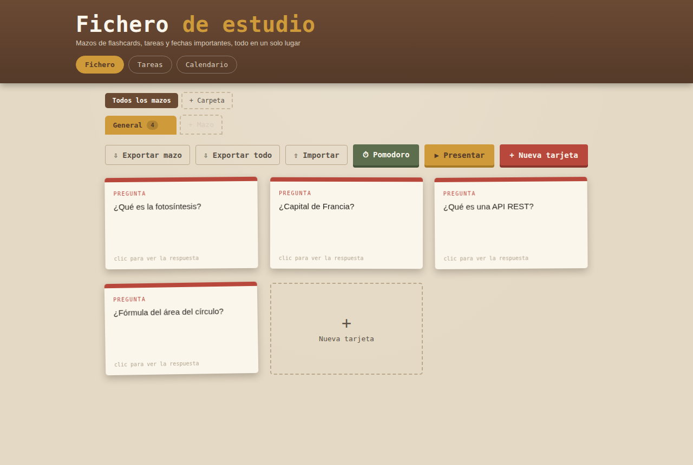
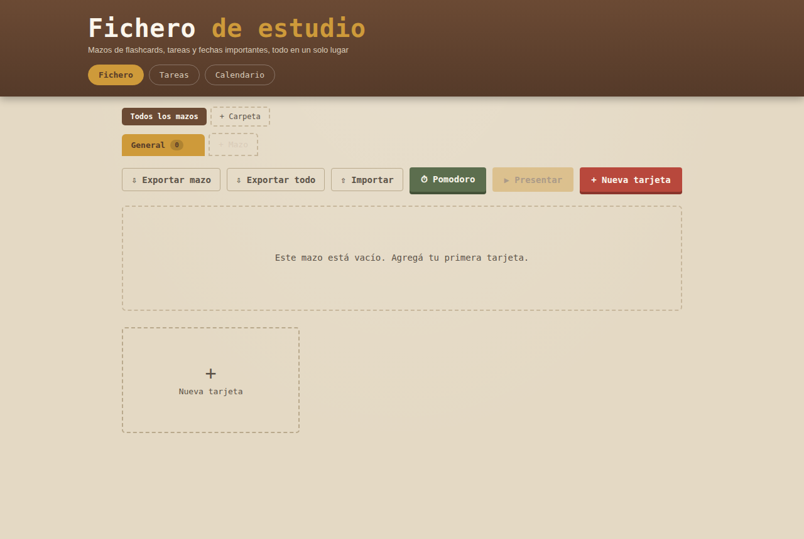

# 📇 Fichero de Estudio

Una app de flashcards, tareas y calendario pensada para estudiar sin depender
de ninguna cuenta, servidor ni conexión a internet. Todo vive en el
navegador (o en una ventana de escritorio nativa, a elección).

**[▶ Ver demo en vivo](#)** _(https://froilangh.github.io/FlashStudy/)_



## Por qué lo hice

Quería una herramienta de estudio simple, sin publicidad, sin registro y sin
depender de que un servidor de terceros siga en pie el día del examen. La
idea fue armar algo que funcione 100% offline, guarde todo localmente, y que
además pudiera abrirse como una app de escritorio normal para quienes
prefieren no vivir en el navegador.

## Funcionalidades

- **Mazos organizados en carpetas**, con pestañas paginadas para manejar
  muchos mazos sin que la interfaz se rompa.
- **Modo presentación** a pantalla completa para repasar tarjeta por tarjeta,
  con navegación por teclado.
- **Tareas y calendario** integrados, con vista de "próximos eventos".
- **Pomodoro** con presets de estudio/descanso y aviso sonoro.
- **Exportar/Importar en JSON** — un mazo suelto o un backup completo de
  todos los mazos, para mover tus datos entre navegadores o simplemente
  tener una copia de seguridad.
- **Cero dependencias de backend**: todo se guarda en `localStorage`.

## Cómo se guardan los datos

La app no tiene servidor ni base de datos. Cada mazo, tarjeta, tarea y
evento se guarda en el `localStorage` del navegador que la abre. Eso quiere
decir:

- Es privado: nadie más ve tus datos, ni siquiera vos desde otro dispositivo.
- No hace falta conexión para usarla (solo para cargar la página la primera
  vez, si la usás vía web).
- Si querés mover tus mazos a otra PC o navegador, usá **Exportar todo** y
  después **Importar** en el destino.

## Stack

- HTML, CSS y JavaScript vanilla — sin frameworks ni build step.
- `localStorage` como capa de persistencia.
- Versión de escritorio con [pywebview](https://pywebview.flowrl.com/)
  (Python), empaquetada con [PyInstaller](https://pyinstaller.org/) para un
  `.exe` independiente en Windows.

Elegí vanilla JS a propósito: es una app relativamente chica, sin necesidad
de manejo de estado complejo, así que un framework hubiera sido peso muerto.

## Correrla localmente

### Como página web

Abrí `index.html` con doble clic, o serví la carpeta con cualquier servidor
estático:

```bash
python -m http.server 8000
# entrá a http://localhost:8000
```

### Como app de escritorio (Windows)

Todo lo necesario está en `desktop-app/`. Requiere tener
[Python](https://python.org) instalado.

```bash
cd desktop-app
pip install -r requirements.txt
python app.py
```

También incluye `1-instalar.bat`, `2-abrir-app.bat` y `3-crear-exe.bat`
para no tener que usar la terminal — ver el detalle en
`desktop-app/LEEME.txt`.

## Estructura del proyecto

```
├── index.html          # estructura y contenido (usado por web y escritorio)
├── styles.css           # estilos
├── app.js                # lógica de la app
├── favicon.svg
├── screenshots/
└── desktop-app/           # versión de escritorio (Windows)
    ├── app.py               # wrapper con pywebview
    ├── requirements.txt
    ├── 1-instalar.bat
    ├── 2-abrir-app.bat
    ├── 3-crear-exe.bat        # genera un .exe independiente
    └── LEEME.txt
```

## Capturas

| Mazo vacío | Mazo con tarjetas |
|---|---|
|  |  |

## Licencia

MIT — usalo, modificalo, lo que quieras.
